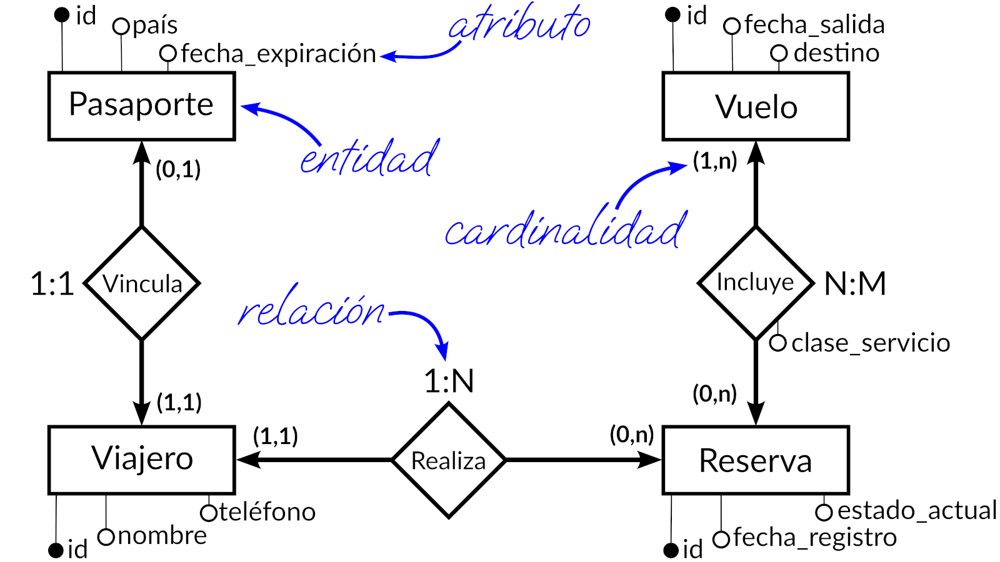
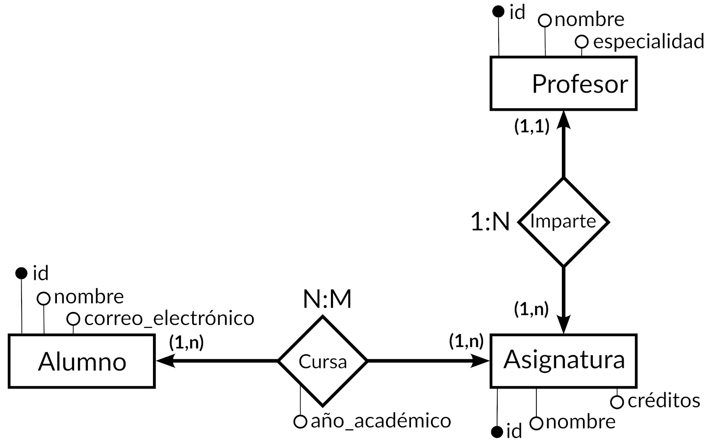

# 1.3. Modelos de datos ([↑](README.md))

_Contenido creado por Manuel Ignacio López Quintero_

Un **modelo de datos** es una representación abstracta y estructurada de la información en un sistema. Define cómo se organiza, almacena, manipula y recupera la información, incluyendo las relaciones entre los distintos tipos de datos.

El **modelo entidad-relación** es un tipo de modelo de datos ampliamente utilizado para estructurar y diseñar bases de datos. Este modelo representa los datos como **entidades**, que son objetos o conceptos con una existencia distinguible e independiente, y como **relaciones**, que son asociaciones entre estas entidades. Cada entidad se describe mediante **atributos**, que son características específicas que definen a la entidad.

Una **entidad** es un objeto o concepto con una existencia distinguible e independiente dentro del dominio del problema y que se pretende representar en un modelo de datos para reflejar sus características y relaciones.

En el modelado de datos, los **atributos** son las características o propiedades que definen y describen las entidades dentro de una base de datos. Los tipos más importantes de atributos atendiendo a su funcionalidad son:

- **Clave**: un atributo de clave simple está formado por un solo atributo que identifica de manera única a cada instancia de una entidad, como el número de identificación personal. Por otro lado, los atributos de clave compuesta están formados por la combinación de dos o más atributos que, en conjunto, identifican de manera única a cada instancia de una entidad, como el número de serie del producto y la fecha de fabricación para identificar un artículo específico en una línea de producción.
- **Descriptivos**: los atributos descriptivos son aquellos que proporcionan información adicional sobre las características o cualidades de una entidad. Estos atributos ayudan a proporcionar un contexto más amplio o detalles que caracterizan a la entidad. Ejemplo: la descripción de un producto en un catálogo, que puede incluir detalles sobre materiales, dimensiones, y características especiales.

Las **relaciones** de un modelo de datos definen cómo las entidades se asocian entre sí dentro de una base de datos. Estas asociaciones permiten comprender la interacción entre las entidades. Los tipos más importantes de relaciones son:

- **De uno a uno (1:1):** una relación uno a uno ocurre cuando cada instancia en una entidad está asociada a una única instancia en otra entidad. Ejemplo: cada licencia de conducir está vinculada a un único conductor.
- **De uno a varios (1:N):** una relación uno a varios se da cuando una instancia en una entidad puede estar asociada con múltiples instancias en otra entidad, pero esas múltiples instancias no están asociadas a más de una instancia en la primera entidad. Ejemplo: un gerente supervisa a varios empleados.
- **De varios a varios (N:M):** una relación varios a varios ocurre cuando múltiples instancias en una entidad pueden estar asociadas con múltiples instancias en otra entidad. Ejemplo: un autor puede escribir varios libros y cada libro puede tener varios autores.

En el modelado de datos, las **cardinalidades** definen las relaciones entre entidades y especifican cuántas instancias de una entidad pueden estar asociadas con instancias de otra entidad. Aquí están las cardinalidades más comunes en un modelo de datos:

- **(0, 1):** cardinalidad de tipo opcional y singular. Una entidad en un extremo de la relación puede tener una relación con cero o una entidad en el otro extremo. Ejemplo: un empleado puede tener cero o un vehículo asignado.
- **(1, 1):** cardinalidad de tipo obligatorio y singular. Una entidad en un extremo de la relación debe tener una relación con exactamente una entidad en el otro extremo. Ejemplo: un empleado tiene exactamente un número de seguro social.
- **(0, n):** cardinalidad de tipo opcional y plural. Una entidad en un extremo de la relación puede tener una relación con cero o más entidades en el otro extremo. Ejemplo: un cliente puede no tener ninguna reserva o puede tener una o más reservas en un hotel.
- **(1, n):** cardinalidad de tipo obligatorio y plural. Una entidad en un extremo de la relación debe tener una relación con una o más entidades en el otro extremo. Ejemplo: un padre tiene al menos un hijo.
- **(n, m):** cardinalidad de tipo plural en ambos extremos. Una entidad en un extremo de la relación puede tener una relación con múltiples entidades en el otro extremo, y viceversa. Ejemplo: un libro puede ser escrito por varios autores y, a su vez, cada autor puede escribir varios libros.

A continuación, se muestra un **ejemplo** básico de un modelo de datos representado en un diagrama entidad-relación:

En este modelo de datos, un viajero se vincula a un solo pasaporte, y un pasaporte solo está vinculado a un viajero. Un viajero puede realizar cero o más reservas, y cada reserva solo puede ser realizada por un viajero. Cada reserva puede incluir uno o más vuelos, y cada vuelo puede estar incluido en cero o más reservas. En el diagrama, los atributos clave se muestran con círculos negros y los atributos descriptivos con círculos blancos.

## Ejercicio resuelto

Diseña un modelo de datos y represéntalo en un diagrama entidad-relación para una base de datos escolar que gestione la información de los alumnos, profesores y asignaturas. El objetivo es estructurar los datos de manera que se puedan organizar, almacenar, manipular y recuperar eficientemente, reflejando las relaciones entre estos elementos.

El modelo debe contemplar las siguientes consideraciones:

- Cada alumno debe tener un identificador (*id*), nombre y correo electrónico.
- Cada profesor debe tener un identificador (*id*), nombre y especialidad.
- Cada asignatura debe tener un identificador (*id*), nombre y créditos (número de horas lectivas).
- Un alumno cursa una o más asignaturas, y una asignatura puede ser cursada por uno o más alumnos; en dicha relación se debe registrar el año académico en que están cursando.
- Un profesor imparte una o más asignaturas, y una asignatura es impartida por un solo profesor.

### Propuesta de solución (revisa solo después de intentar resolverlo por ti mismo)

A continuación, se presenta una propuesta para el modelo de datos en el siguiente diagrama entidad-relación:

_Contenido creado por Manuel Ignacio López Quintero_
