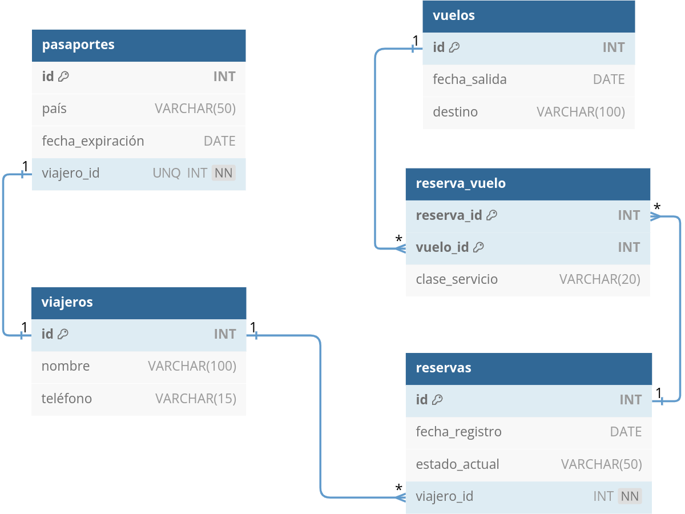

# 1.4. Modelos de bases de datos ([↑](README.md))

_Contenido creado por Manuel Ignacio López Quintero_

Un **modelo de base de datos** es una representación estructurada de cómo se almacenan, organizan y manipulan los datos en un Sistema Gestor de Bases de Datos (SGBD). Este modelo define la estructura lógica y física de la base de datos y establece las relaciones entre los distintos tipos de datos. Los modelos de bases de datos más comunes incluyen el modelo relacional, el modelo de red y el modelo jerárquico, aunque el modelo relacional es el más utilizado debido a su simplicidad y flexibilidad.

El **modelo relacional** es un paradigma para gestionar bases de datos donde los datos se organizan en **tablas** (también llamadas relaciones). Cada tabla está compuesta por filas y columnas, donde cada fila representa un registro único y cada columna representa un atributo del registro. Este modelo fue propuesto por Edgar F. Codd en 1970 y se basa en la teoría de conjuntos y la lógica de predicados.

En una base de datos relacional, las tablas están relacionadas entre sí mediante claves primarias y claves foráneas. La **clave primaria** es un atributo o un conjunto de atributos que identifican de manera única cada registro en una tabla, mientras que la **clave foránea** es un atributo en una tabla que hace referencia a la clave primaria de otra tabla, estableciendo así una relación entre ambas.

Para **transformar un modelo entidad-relación a un modelo relacional**, se siguen estos pasos:

- **Entidades a tablas:** cada entidad del modelo entidad-relación se transforma en una tabla en el modelo relacional. Los atributos clave de la entidad se convierten en la clave primaria de la tabla correspondiente.  

- **Relaciones N-M:** las relaciones varios a varios (N:M) siempre generan una nueva tabla. Esta nueva tabla incluye las claves foráneas que corresponden a las claves primarias de las entidades involucradas en la relación. Dichas claves foráneas también son clave primaria en la nueva tabla. Además, si la relación tiene atributos propios, estos se incluyen en esta nueva tabla.  

- **Relaciones 1-N:** generalmente, no se crea una nueva tabla para las relaciones uno a varios (1:N). Solo si la entidad del lado *1* tiene una cardinalidad opcional y singular (0,1), se crea una nueva tabla que incluye las claves foráneas de ambas entidades y la clave primaria de esta nueva tabla será la clave de la entidad del lado *N*. En los demás casos, la clave de la entidad del lado *1* se añade como clave foránea en la tabla de la entidad del lado *N*. Los atributos propios de la relación se añaden a la tabla que recibe la clave foránea.  

- **Relaciones 1-1:** las relaciones uno a uno (1:1) no suelen generar una nueva tabla. Solo si ambas entidades tienen una cardinalidad opcional y singular (0,1), se crea una nueva tabla para la relación. En dicha tabla se añaden como claves foráneas las claves primarias de ambas entidades, y una de estas claves foráneas forma la clave primaria de la nueva tabla. Si una entidad tiene una cardinalidad opcional y singular (0,1) pero la otra tiene cardinalidad obligatoria y singular (1,1), la clave de la entidad con cardinalidad obligatoria se añade como clave foránea en la entidad con cardinalidad opcional. Si ambas entidades tienen cardinalidad obligatoria y singular (1,1), se elige una clave primaria y se añade como clave foránea en la otra entidad. Los atributos de la relación se añaden a la tabla que recibe la clave foránea.  

La **normalización** es el proceso de organizar los datos en una base de datos para reducir la redundancia y mejorar la integridad de los datos. Este proceso se lleva a cabo mediante la aplicación de una serie de reglas denominadas **formas normales** (FN). Las tres primeras formas normales son las más comúnmente utilizadas:

- **Primera Forma Normal (FN1):** una tabla está en FN1 si todos los valores de sus columnas son **atómicos**, es decir, cada columna contiene solo un valor indivisible. Esto elimina los grupos repetitivos y las listas de valores dentro de una sola columna.  
  *Ejemplo:* una tabla *Clientes* con las columnas *id_cliente*, *nombre*, *teléfonos*. Para estar en FN1, se debe dividir *teléfonos* en múltiples registros con una sola entrada por fila.  

- **Segunda Forma Normal (FN2):** una tabla está en FN2 si cumple con FN1 y además todos los atributos no clave dependen **totalmente** de la clave primaria. Esto significa que no debe haber dependencias parciales, donde un atributo depende solo de una parte de una clave primaria compuesta.  
  *Ejemplo:* una tabla *Pedidos* con las columnas *id_pedido* y *id_producto* como clave primaria compuesta, y las columnas *nombre_producto* y *cantidad*. Para estar en FN2, *nombre_producto* debe moverse a la tabla *Productos*, ya que depende solo de *id_producto*.  

- **Tercera Forma Normal (FN3):** una tabla está en FN3 si cumple con FN2 y además todos los atributos no clave son **mutuamente independientes**. Es decir, no debe haber dependencias transitivas, donde un atributo no clave depende de otro atributo no clave.  
  *Ejemplo:* una tabla *Clientes* con la columna *id_cliente* como clave primaria y las columnas *nombre_cliente*, *id_ciudad* y *nombre_ciudad*. Para estar en FN3, *nombre_ciudad* debe moverse a una tabla *Ciudades* ya que depende de *id_ciudad*, no directamente de *id_cliente*.  

La aplicación de estas formas normales asegura que los datos estén organizados de manera eficiente, minimizando la redundancia y el riesgo de inconsistencias, lo que facilita la **integridad** y la **eficiencia** del sistema de bases de datos.

A continuación, se muestra un **ejemplo** básico de un modelo relacional, transformado a partir del modelo de datos de la sección anterior, mediante el siguiente esquema relacional:

  

En este modelo relacional los símbolos `1` y `*` indican las cardinalidades uno y varios, respectivamente. Cada tabla tiene una clave primaria denominada `id`, que es un identificador único para cada registro, excepto la tabla intermedia `reserva_vuelo` que utiliza una clave primaria compuesta. Las claves foráneas, como `viajero_id` y `reserva_id`, son las que establecen las relaciones entre las tablas. La cláusula `UNQ` significa que el campo es único y no puede repetirse, mientras que `NN` (NOT NULL) indica que el campo no puede estar vacío.  

Por ejemplo, en la tabla `pasaportes`, el campo `viajero_id` es único y no puede ser nulo, indicando que cada pasaporte está vinculado a un solo viajero específico.

_Contenido creado por Manuel Ignacio López Quintero_
