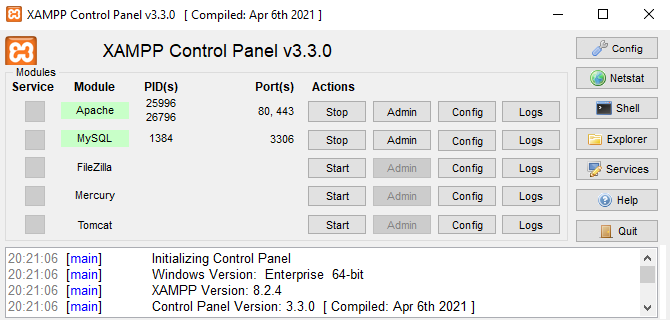

# 2.1. Instalación y configuración ([↑](README.md))

_Contenido creado por Manuel Ignacio López Quintero_

Dentro de las diversas opciones disponibles para instalar [MariaDB](https://en.wikipedia.org/wiki/MariaDB), una de las más sencillas es mediante el uso de [XAMPP](https://www.apachefriends.org), un paquete que incluye Apache, MariaDB, PHP y Perl. Este método permite que incluso usuarios con poca experiencia en configuración de servidores puedan desplegar un entorno de desarrollo completo de forma rápida y sin complicaciones.

Para la instalación de XAMPP, el proceso varía ligeramente entre sistemas operativos. En Windows se debe descargar el instalador desde el sitio web oficial de [Apache Friends](https://www.apachefriends.org) y seguir las instrucciones del asistente de instalación, que incluyen seleccionar los componentes a instalar y especificar el directorio de destino. En **GNU/Linux** también se descarga el instalador desde el [sitio web oficial](https://www.apachefriends.org), pero en este caso se trata de un *script* `.run`, que se ejecuta en la terminal con permisos de administrador (por ejemplo, `sudo ./xampp-linux-x64-x.x.x-0-installer.run`), siguiendo pasos similares a los de Windows para completar la instalación.

Una vez instalado XAMPP, es muy importante que todos los **componentes necesarios** estén funcionando correctamente.

En **Windows** se puede gestionar XAMPP a través del **XAMPP Control Panel**, desde donde se inician y detienen los módulos de Apache, MySQL (MariaDB) y otros. Para comprobar que MariaDB está operativo, se puede abrir el **Shell de XAMPP** desde el panel de control y ejecutar: `mariadb --version`, lo cual debería mostrar la versión de MariaDB instalada.

En **GNU/Linux**, la gestión de XAMPP se realiza principalmente a través de la terminal. Para iniciar todos los módulos, se utiliza el comando `sudo /opt/lampp/xampp start`. Para verificar la instalación de MariaDB, se puede usar el comando `/opt/lampp/bin/mariadb --version`. Si el sistema devuelve la versión de MariaDB, significa que está correctamente instalado y funcionando.

El acceso a MariaDB para su configuración y gestión puede hacerse también mediante _phpMyAdmin_, una herramienta de software libre diseñada para manejar la administración de MySQL y MariaDB a través de la web.

Para acceder a _phpMyAdmin_ tanto en Windows como en GNU/Linux, primero es necesario verificar que los servicios de Apache y MariaDB en XAMPP están operativos. Una vez confirmado esto, se debe abrir un navegador y visitar `http://localhost/phpmyadmin`. Aquí, el usuario puede manejar bases de datos, usuarios, permisos y realizar ajustes de configuración según sea necesario a través de una interfaz web intuitiva.

## Seguridad y mantenimiento de MariaDB

Para garantizar la seguridad de la instalación de MariaDB, es importante cambiar la contraseña del usuario `root`, que por defecto viene sin ella. Esto evita accesos no autorizados y protege la integridad de los datos. Para cambiar la contraseña, se puede utilizar _phpMyAdmin_ accediendo a la pestaña Usuarios, seleccionando el usuario `root` y editando la contraseña desde allí. Alternativamente, se puede realizar con el siguiente comando SQL de MariaDB: `SET PASSWORD FOR 'root'@'localhost' = PASSWORD('nueva_contraseña');`.

Además, es conveniente configurar copias de seguridad regulares de las bases de datos utilizando herramientas como `mariadb-dump`. Automatizar este proceso mediante, por ejemplo, _scripts_ simplifica la gestión y asegura la periodicidad de las copias de seguridad. Asimismo, revisar y ajustar los permisos de los usuarios de MariaDB mejora la seguridad general del sistema. Limitar los privilegios a solo aquellos necesarios para cada usuario reduce el riesgo de operaciones no autorizadas o malintencionadas.

_Contenido creado por Manuel Ignacio López Quintero_
