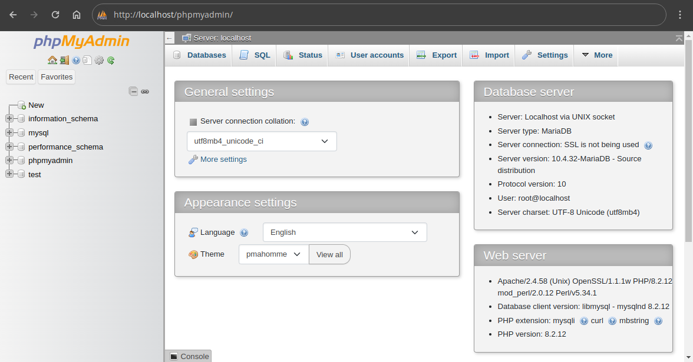

# 2.2. Herramientas de administración ([↑](README.md))

_Contenido creado por Manuel Ignacio López Quintero_

La **administración de bases de datos** en sistemas que utilizan [MySQL](https://en.wikipedia.org/wiki/MySQL) o [MariaDB](https://en.wikipedia.org/wiki/MariaDB) se facilita mediante diversas herramientas que permiten ejecutar comandos, gestionar usuarios, realizar copias de seguridad, entre otras funciones. En esta sección, se analizarán cuatro herramientas: la interfaz gráfica [_phpMyAdmin_]([phpMyAdmin](https://en.wikipedia.org/wiki/PhpMyAdmin)) y los comandos `mariadb`, `mariadb-dump` y `mariadb-admin`.

La herramienta *phpMyAdmin* es una interfaz gráfica basada en web que facilita la gestión de MySQL y MariaDB. Permite a los usuarios llevar a cabo diversas tareas administrativas, como ejecutar consultas [SQL](https://en.wikipedia.org/wiki/SQL), gestionar usuarios y realizar copias de seguridad, entre otras, de manera gráfica e intuitiva y sin necesidad de conocimientos de línea de comandos.



Con respecto a los comandos, `mariadb` es la herramienta principal de línea de comandos utilizada para interactuar con el servidor MariaDB. Permite ejecutar consultas **SQL** directamente desde el terminal y gestionar bases de datos de manera eficiente. Para conectarse al servidor MariaDB, se utiliza la siguiente sintaxis básica:

```bash
mariadb -u usuario -p
```

Aquí, `usuario` debe ser reemplazado por el nombre del usuario en cuestión, y `-p` indica que se solicitará la contraseña. Si no se utilizan las opciones `-h` y `-P`, como en este caso, se asume que el servidor está en el *host* local (*localhost*) y en el puerto por defecto (`3306`). Una vez autenticado correctamente, es posible ver la lista de bases de datos disponibles con:

```sql
SHOW DATABASES;
```

Para seleccionar una base de datos específica, se utiliza:

```sql
USE nombre_base_datos;
```

Y luego es posible ejecutar consultas SQL dentro de dicha base de datos. Por ejemplo:

```sql
SELECT * FROM nombre_tabla;
```

Esto mostrará todos los registros de la tabla especificada. Además, el comando `mariadb` permite crear y eliminar bases de datos con:

```sql
CREATE DATABASE nombre_base_datos;
DROP DATABASE nombre_base_datos;
```

Para crear un usuario con todos los privilegios, se puede utilizar el siguiente comando en `mariadb`:

```sql
CREATE USER 'nuevo_usuario'@'localhost' IDENTIFIED BY 'contrasena';
GRANT ALL PRIVILEGES ON *.* TO 'nuevo_usuario'@'localhost' WITH GRANT OPTION;
```

El primer comando crea un nuevo usuario con la contraseña especificada. El segundo comando otorga todos los privilegios sobre todas las bases de datos y tablas al usuario recién creado, incluyendo la opción de otorgar permisos a otros usuarios.

También se puede ejecutar un ***script* SQL** usando:

```bash
mariadb -u usuario -p < archivo.sql
```

Esta línea ejecuta un *script* SQL desde un archivo. Aquí, `archivo.sql` es el nombre del archivo con el código SQL.

Gracias al comando `mariadb-dump` se puede realizar una copia de seguridad de una base de datos con:

```bash
mariadb-dump -u usuario -p nombre_bd > archivo.sql
```

Este comando exporta la estructura y los datos de la base de datos `nombre_bd` a un archivo SQL, el cual se especifica como `archivo.sql`.

El comando `mariadb-admin` es una herramienta de línea de comandos utilizada para realizar tareas administrativas en el servidor MariaDB. Proporciona una serie de funciones que permiten gestionar el servidor de manera más eficiente. El comando `mariadb-admin` permite iniciar y detener el servidor MariaDB con:

```bash
mariadb-admin -u usuario -p start
mariadb-admin -u usuario -p shutdown
```

El primer comando inicia el servidor, mientras que el segundo lo apaga. Además, es posible cambiar la contraseña de un usuario con:

```bash
mariadb-admin -u usuario -p password 'nueva_contraseña'
```

Esto cambia la contraseña del usuario especificado. Para obtener información sobre el estado actual del servidor, se puede usar:

```bash
mariadb-admin -u usuario -p status
```

Este comando proporciona un resumen del estado actual del servidor, incluyendo el número de consultas ejecutadas y el tiempo de actividad.

_Contenido creado por Manuel Ignacio López Quintero_
