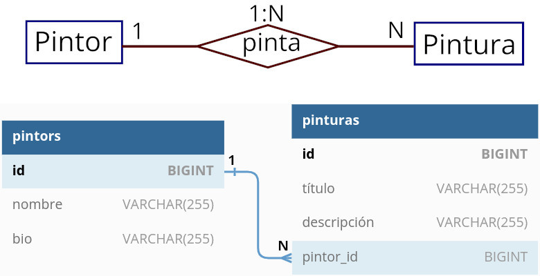

# 3.5. Uso de Eloquent en relaciones uno a varios ([↑](README.md))

_Contenido creado por Manuel Ignacio López Quintero_

A continuación, aprenderás a utilizar Eloquent de Laravel para manejar relaciones uno a varios. Trabajaremos con un modelo de datos de ejemplo que tiene dos entidades, `Pintor` y `Pintura`, y que estarán relacionadas mediante una relación uno a varios. El modelo de datos se representa en el siguiente esquema Entidad-Relación:



## Paso 1: Crea una base de datos

Comienza por abrir XAMPP y accede a PhpMyAdmin. Allí, necesitarás crear una nueva base de datos que llamaremos `laravel_eloquent_1n`.

## Paso 2: Crea un nuevo proyecto de Laravel

Ahora, genera un nuevo proyecto Laravel utilizando el comando `composer create-project laravel/laravel eloquent-uno-varios` en tu terminal. Esto te proporcionará una nueva aplicación Laravel en blanco donde podrás comenzar a trabajar.

## Paso 3: Enlaza tu proyecto a la base de datos

Asegúrate de que tu aplicación Laravel puede comunicarse con tu base de datos. Para hacer esto, navega a la carpeta del proyecto y abre el archivo `.env`. Aquí, deberás introducir los detalles de la base de datos que acabas de crear. Un ejemplo sería el siguiente:

```php
DB_CONNECTION=mysql
DB_HOST=127.0.0.1
DB_PORT=3306
DB_DATABASE=laravel_eloquent_1n
DB_USERNAME=root
DB_PASSWORD=
```

## Paso 4: Crea los modelos y sus respectivas migraciones

Laravel emplea modelos para representar las tablas de tu base de datos, mientras que utiliza las migraciones para crear y modificar dichas tablas. En este caso, hay que crear dos modelos junto a sus respectivas migraciones: uno para `Pintor` y otro para `Pintura`.

Para hacer esto, entra en tu terminal a la carpeta del proyecto y procede a generar el modelo y la migración para `Pintor` mediante el siguiente comando:

```php
php artisan make:model Pintor --migration
```

Esto generará un archivo de migración que creará la tabla denominada `pintors`. Este nombre se debe a que Laravel, por defecto, utiliza el nombre en minúsculas del modelo y lo pluraliza en inglés agregando una `s` al final.

Luego de esto, procede a generar el modelo y el archivo de migración para `Pintura` mediante el siguiente comando:

```php
php artisan make:model Pintura --migration
```

Así se generan los modelos y archivos de migraciones necesarias para `Pintor` y `Pintura` en tu proyecto Laravel.

## Paso 5: Edita las migraciones

A continuación, debemos abrir y editar los archivos de migración correspondientes a las tablas `pintors` y `pinturas`. Estas migraciones se encargan de crear la estructura de las tablas en la base de datos.

Ahora, abre el archivo de migración `create_pintors_table` y modifica el método `up()` con el siguiente código:

```php
public function up(): void
{
    Schema::create('pintors', function (Blueprint $table)
    {
        $table->id();

        $table->string('nombre')->unique();
        $table->string('bio');

        $table->timestamps();
    });
}
```

Este código define la estructura de la tabla `pintors` con las columnas `nombre` y `bio`, junto con las columnas necesarias para el control de tiempo de creación y actualización.

Luego, abre el archivo de migración `create_pinturas_table` y modifica el método `up()` con el siguiente código:

```php
public function up(): void
{
    Schema::create('pinturas', function (Blueprint $table)
    {
        $table->id();

        $table->string('título');
        $table->string('descripción');

        $table->foreign('pintor_id')->references('id')->on('pintors');

        $table->timestamps();
    });
}
```

Este código define la estructura de la tabla `pinturas`. La línea de código `$table->foreign('pintor_id')->references('id')->on('pintors');` establece una columna `pintor_id` en la tabla `pinturas` y define una restricción de clave foránea o secundaria. Esta restricción vincula la columna `pintor_id` con la clave primaria `id` de la tabla `pintors`. Esto asegura que los valores en `pintor_id` deben corresponder a un registro existente en la columna `id` de la tabla `pintors`. De esta manera, se garantiza la integridad referencial y se impide la inserción de valores en `pintor_id` que no estén presentes en la tabla relacionada. Lo que se consigue con esto es establecer una relación **uno a varios** entre la tabla `pintores` y la tabla `pinturas`, es decir, un pintor puede pintar una o más pinturas, mientras que cada pintura está asociada a un solo pintor.

## Paso 6: Ejecuta las migraciones

Una vez que hayas modificado los archivos de migración, ejecuta `php artisan migrate` en la terminal para crear las tablas en tu base de datos. Si necesitas hacer cambios en tus migraciones, recuerda ejecutar `php artisan migrate:fresh` para restablecer la base de datos.

Luego, entra en PhpMyAdmin y verifica si se han creado las tablas y las relaciones correctamente entrando en la pestaña `Designer` de la base de datos `laravel_eloquent_1n`.

## Paso 7: Define las rutas

En `routes/web.php`, configura las rutas que permitirán a tu aplicación interactuar con los datos de los pintores y las pinturas:

```php
<?php

use App\Http\Controllers\ProfileController;
use Illuminate\Support\Facades\Route;

use App\Http\Controllers\PintorController;
use App\Http\Controllers\PinturaController;

Route::get('/', function () {
  return 'Ejemplo de Eloquent de una relación uno a varios.';
});

Route::get('/agregar-pintores', [PintorController::class, 'store'])
    ->name('guardar');

Route::get('/mostrar-pintores', [PintorController::class, 'index'])
    ->name('indexar');

Route::get('/mostrar-pintor-{id}', [PintorController::class, 'show'])
    ->name('enseñar');

Route::get('/modificar-pintor', [PintorController::class, 'update'])
    ->name('actualizar');

Route::get('/borrar-primer-pintor', [PintorController::class, 'remove'])
    ->name('eliminar');

Route::get('/agregar-pinturas', [PinturaController::class, 'add'])
    ->name('añadir');

Route::get('/mostrar-pinturas', [PinturaController::class, 'present'])
    ->name('presentar');
```

## Paso 8: Crea los controladores

Ahora, debes crear controladores para tus modelos Pintor y Pintura. Los controladores manejan la lógica de tu aplicación y las interacciones con la base de datos. Utiliza `php artisan make:controller PintorController` y `php artisan make:controller PinturaController` para crear estos controladores.

Una vez creados, abre el controlador `PintorController` e introduce el siguiente código:

```php
<?php

namespace App\Http\Controllers;

use Illuminate\Http\Request;

use App\Models\Pintor;

class PintorController extends Controller
{
    public function store()
    {
        $pintor = new Pintor;
        $pintor->nombre = 'Leonardo Da Vinci';
        $pintor->bio = 'Pintor renacentista, ingeniero, inventor, etc.';
        $pintor->save();

        $pintor = new Pintor;
        $pintor->nombre = 'Diego Velázquez';
        $pintor->bio = 'Pintor barroco español y maestro universal.';
        $pintor->save();

        $pintor = new Pintor;
        $pintor->nombre = 'Rembrandt';
        $pintor->bio = 'Pintor muy admirado por su vívido realismo.';
        $pintor->save();

        $pintor = new Pintor;
        $pintor->nombre = 'Francisco de Goya';
        $pintor->bio = 'Pintor español precursor del expresionismo.';
        $pintor->save();

        return 'Cuatro pintores insertados en la base de datos.';
    }

    public function index()
    {
        $pintores = Pintor::all();

        return $pintores;
    }

    public function show(string $id)
    {
        $pintor = Pintor::find($id);

        return $pintor;
    }

    public function update()
    {
        $pintor = Pintor::where('nombre', 'Leonardo Da Vinci')->first();
        $pintor->nombre = 'Leonardo di ser Piero da Vinci';
        $pintor->save();
    }

    public function remove()
    {
        $pintor = Pintor::find(1);
        $pintor->delete();
    }
}
```

Luego, edita `PinturaController` con el siguiente código:

```php
<?php

namespace App\Http\Controllers;

use Illuminate\Http\Request;

use App\Models\Pintor;
use App\Models\Pintura;

class PinturaController extends Controller
{
    public function add()
    {
        $pintor = Pintor::find(2);

        $pintura = new Pintura;

        $pintura->título = 'Las meninas';
        $pintura->descripción = 'Muy popular y de grandes dimensiones';
        $pintura->pintor_id = $pintor->id;

        $pintura->save();


        $pintura = new Pintura;

        $pintura->título = 'Vieja friendo huevos';
        $pintura->descripción = 'Pintado en Sevilla en 1618.';
        $pintura->pintor_id = $pintor->id;

        $pintura->save();
    }

    public function present()
    {
        $pinturas = Pintura::all();

        return $pinturas;
    }
}
```

Ahora, y muy importante, asegúrate de que todo está funcionando correctamente ejecutando `php artisan serve` y abriendo tu aplicación en el navegador. Experimenta con las diferentes rutas definidas y juega con las relaciones entre pintores y pinturas.

## Paso 9: Define las relaciones entre los modelos

Para terminar, vamos a definir las relaciones uno a varios y su inversa entre Pintor y Pintura en los modelos.

Abre `app/Models/Pintor.php` y crea la relación uno a varios con el siguiente código:

```php
<?php

namespace App\Models;

use Illuminate\Database\Eloquent\Factories\HasFactory;
use Illuminate\Database\Eloquent\Model;
use Illuminate\Database\Eloquent\Relations\HasMany;

class Pintor extends Model
{
    use HasFactory;

    public function pinturas(): HasMany
    {
        return $this->hasMany(Pintura::class);
    }
}
```

Abre `app/Models/Pintura.php` y crea la relación uno a varios inversa con el siguiente código:

```php
<?php

namespace App\Models;

use Illuminate\Database\Eloquent\Factories\HasFactory;
use Illuminate\Database\Eloquent\Model;
use Illuminate\Database\Eloquent\Relations\BelongsTo;

class Pintura extends Model
{
    use HasFactory;

    public function pintor(): BelongsTo
    {
        return $this->belongsTo(Pintor::class);
    }
}
```

## Paso 10: Define nuevas rutas y crea el nuevo controlador

Ahora, añade en el archivo de texto `routes/web.php` el siguiente código:

```php
use App\Http\Controllers\Relacion1NController;

Route::get('/pinturas-velazquez', [Relacion1NController::class, 'read'])
    ->name('leer');

Route::get('/pintor-meninas', [Relacion1NController::class, 'display'])
    ->name('exponer');
```

Luego, crea un controlador con `php artisan make:controller Relacion1NController` y ponlo así:

```php
<?php

namespace App\Http\Controllers;

use Illuminate\Http\Request;

use App\Models\Pintor;
use App\Models\Pintura;

class Relacion1NController extends Controller
{
    public function read()
    {
        $pintor = Pintor::whereNombre('Diego Velázquez')->first();

        foreach($pintor->pinturas as $pintura)
        {
            echo $pintura->título . '<br />';
            echo $pintura->descripción . '<br /><br />';
        }
    }

    public function display()
    {
        $pintura = Pintura::whereTítulo('Las meninas')->first();

        echo $pintura->pintor->id . '<br />';
        echo $pintura->pintor->nombre . '<br />';
        echo $pintura->pintor->bio . '<br />';
    }
}
```

## Paso 11: Prueba tu proyecto

Finalmente, llegó el momento de lanzar tu aplicación web. Para lograrlo, abre tu terminal y ejecuta el siguiente comando: `php artisan serve`. Al hacerlo, se iniciará un servidor de desarrollo en la dirección `http://localhost:8000`.

Verifica no solo las rutas creadas al principio sino las rutas que has definido recientemente, `/pinturas-velazquez` y `/pintor-meninas`, que se encargan de la relación uno a varios y uno a varios inversa, respectivamente.

## Paso 12: Experimenta y amplía tus conocimientos

Ahora que ya tienes una introducción a cómo crear modelos, definir relaciones y manejar colecciones con Eloquent en Laravel, es el momento de que refuerces lo aprendido. Modifica los modelos que has creado, establece nuevas relaciones y experimenta con las colecciones para familiarizarte con el poder de Eloquent.

Si quieres aprender más, te recomendamos que te adentres en la documentación oficial de Laravel sobre Eloquent, sus relaciones y colecciones:

- Documentación oficial de Laravel sobre [**Eloquent**](https://laravel.com/docs/eloquent).
- Documentación oficial de Laravel sobre [**relaciones en Eloquent**](https://laravel.com/docs/eloquent-relationships).
- Documentación oficial de Laravel sobre [**colecciones en Eloquent**](https://laravel.com/docs/eloquent-collections).

_Contenido creado por Manuel Ignacio López Quintero_
