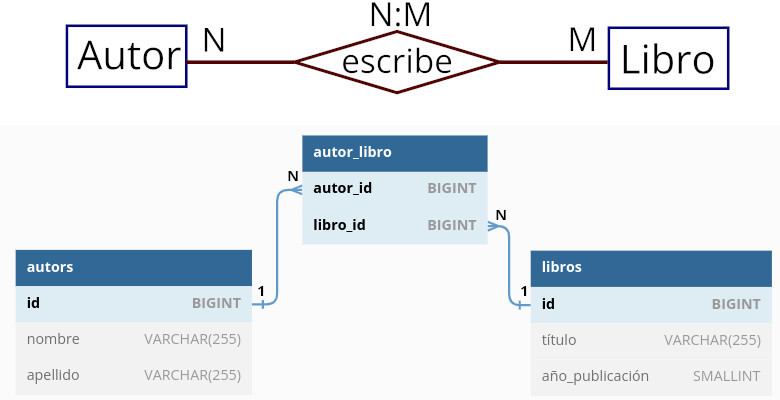

# 3.6. Uso de Eloquent en relaciones varios a varios ([↑](README.md))

_Contenido creado por Manuel Ignacio López Quintero_

El ejercicio a resolver es el siguiente:



Configura una base de datos para una librería utilizando Laravel y Eloquent. Crea un modelo `Autor`, especificado con `nombre` y `apellido`, y un modelo `Libro`, que incluirá `título` y `año de publicación`. Establece una relación de varios a varios entre `Autor` y `Libro` ayudándote de una tabla intermedia. Después, configura rutas de ejemplo para manipular estos datos. Por último, ejecuta la aplicación para asegurarte de que todo funcione correctamente.

El objetivo de este ejercicio es practicar cómo configurar y usar las **relaciones de varios a varios en Eloquent**, el ORM (Object-Relational Mapping) proporcionado por Laravel.

A continuación, se muestra una propuesta para la resolución de este ejercicio.

## Paso 1: Crea la base de datos

Primero, inicia XAMPP y abre PhpMyAdmin. Una vez ahí, crea una nueva base de datos con el nombre `laravel_eloquent_nm`.

## Paso 2: Crea un proyecto de Laravel nuevo

En la línea de comandos, ingresa el siguiente código para crear un nuevo proyecto Laravel:

```bash
composer create-project laravel/laravel eloquent-varios-varios
```

## Paso 3: Configura la conexión a la base de datos

Navega hasta el archivo `.env` en el directorio raíz de tu proyecto. Aquí debes proporcionar los detalles de conexión a tu base de datos.

## Paso 4: Genera los modelos y sus migraciones

Genera un modelo llamado Autor y su correspondiente migración con el comando:

```bash
php artisan make:model Autor --migration
```

Luego, repite este paso para crear la entidad Libro:

```bash
php artisan make:model Libro --migration
```

## Paso 5: Configura las migraciones

Abre el archivo `create_autors_table` y reemplaza el contenido del método `up()` con el siguiente código:

```php
public function up(): void
{
    Schema::create('autors', function (Blueprint $table)
    {
        $table->id();
        $table->string('nombre');
        $table->string('apellido');
        $table->timestamps();
    });
}
```

Haz lo mismo para el archivo `create_libros_table`:

```php
public function up(): void
{
    Schema::create('libros', function (Blueprint $table)
    {
        $table->id();
        $table->string('título');
        $table->unsignedSmallInteger('año_publicación');
        $table->timestamps();
    });
}
```

## Paso 6: Crea la tabla pivote

En las relaciones varios a varios, tanto en el modelo relacional como en Laravel, se requiere de una tabla pivote. Para resolver esto, crea una migración para esta tabla con el siguiente comando:

```bash
php artisan make:migration create_autor_libro_table
```

Abre el archivo de migración recién creado y reemplaza el contenido del método `up()` por el siguiente:

```php
public function up(): void
{
    Schema::create('autor_libro', function (Blueprint $table)
    {
        $table->foreignId('autor_id')->constrained();
        $table->foreignId('libro_id')->constrained();
        $table->primary(['autor_id', 'libro_id']);
        $table->timestamps();
    });
}
```

## Paso 7: Ejecuta las migraciones

Aplica las migraciones a tu base de datos con el comando:

```bash
php artisan migrate
```

Verifica en PhpMyAdmin si se han creado las tablas y las relaciones correctamente en la pestaña `Designer`.

## Paso 8: Define las relaciones en los Modelos

Ahora, es hora de definir las relaciones varios a varios en tus modelos. Abre el archivo `app/Models/Autor.php` y añade el método `libros()`:

```php
public function libros(): BelongsToMany
{
    return $this->belongsToMany(Libro::class);
}
```

Y en el archivo `app/Models/Libro.php`, añade el método `autores()`:

```php
public function autores(): BelongsToMany
{
    return $this->belongsToMany(Autor::class);
}
```

Recuerda añadir al principio la línea de código `use Illuminate\Database\Eloquent\Relations\BelongsToMany;` para importar la clase `BelongsToMany`.

## Paso 9: Define las rutas

En el archivo `routes/web.php`, define las rutas que usarán las funciones de tu controlador:

```php
<?php

use Illuminate\Support\Facades\Route;
use App\Http\Controllers\RelacionNMController;

Route::get('/', function () {
  return 'Ejercicio resuelto de Eloquent de una relación varios a varios.';
});

Route::get('/crear-autores-libros', [RelacionNMController::class, 'agregar'])
     ->name('insertar');

Route::get('/autores-libros', [RelacionNMController::class, 'ver'])
     ->name('leer');

Route::get('/libros-autores', [RelacionNMController::class, 'mostrar'])
     ->name('exponer');
```

## Paso 10: Crea el controlador

Crea un nuevo controlador con el comando:

```bash
php artisan make:controller RelacionNMController
```

Y ponlo así:

```php
<?php

namespace App\Http\Controllers;

use Illuminate\Http\Request;
use App\Models\Autor;
use App\Models\Libro;

class RelacionNMController extends Controller
{
    public function agregar()
    {
        $autor1 = new Autor;
        $autor1->nombre = 'Brian Wilson';
        $autor1->apellido = 'Kernighan';
        $autor1->save();

        $autor2 = new Autor;
        $autor2->nombre = 'Dennis MacAlistair';
        $autor2->apellido = 'Ritchie';
        $autor2->save();

        $autor3 = new Autor;
        $autor3->nombre = 'Robert';
        $autor3->apellido = 'Pike';
        $autor3->save();

        $autor4 = new Autor;
        $autor4->nombre = 'Phillip James';
        $autor4->apellido = 'Plauger';
        $autor4->save();

        $libro1 = new Libro;
        $libro1->título = 'The C Programming Language';
        $libro1->año_publicación = '1978';
        $libro1->save();

        $libro2 = new Libro;
        $libro2->título = 'The Unix Programming Environment';
        $libro2->año_publicación = '1984';
        $libro2->save();

        $libro3 = new Libro;
        $libro3->título = 'The Elements of Programming Style';
        $libro3->año_publicación = '1978';
        $libro3->save();

        $libro4 = new Libro;
        $libro4->título = 'The Standard C Library';
        $libro4->año_publicación = '1992';
        $libro4->save();

        $libro1->autores()->attach([$autor1->id, $autor2->id]);
        $libro2->autores()->attach([$autor1->id, $autor3->id]);
        $libro3->autores()->attach([$autor1->id, $autor4->id]);
        $libro4->autores()->attach([$autor4->id]);

        return 'Autores y libros insertados y relacionados en la BBDD.';
    }

    public function ver()
    {
        $autores = Autor::all();

        foreach ($autores as $autor)
        {
            echo $autor->nombre . ' ' . $autor->apellido;
            echo ' es autor de:';
            echo '<ul>';

            foreach ($autor->libros as $libro)
            {
                echo '<li>' . $libro->título;
                echo ' (' . $libro->año_publicación . ').</li>';
            }

            echo '</ul>';
        }
    }

    public function mostrar()
    {
        $libros = Libro::all();

        foreach ($libros as $libro)
        {
            echo 'El libro ' . $libro->título . ' (';
            echo $libro->año_publicación . ') está escrito por:';
            echo '<ul>';

            foreach ($libro->autores as $autor)
            {
                echo '<li>' . $autor->nombre;
                echo ' ' . $autor->apellido . '.</li>';
            }

            echo '</ul>';
        }
    }
}
```

## Paso 11: Prueba la aplicación

Ahora, ejecuta el servidor de Laravel con el comando:

```bash
php artisan serve
```

A continuación, visita las rutas en tu aplicación web en un orden específico. Comienza con  
`http://localhost:8000/crear-autores-libros` para insertar y relacionar autores y libros en la base de datos. Luego, dirígete a  
`http://localhost:8000/autores-libros` para ver la lista de autores y los libros que han escrito. Finalmente, ve a  
`http://localhost:8000/libros-autores` para ver los libros y sus respectivos autores.

## Paso 12: Investiga y experimenta por ti mismo

Finalmente, experimenta y juega con el código para comprender mejor cómo funcionan las relaciones varios a varios en Laravel.

_Contenido creado por Manuel Ignacio López Quintero_
