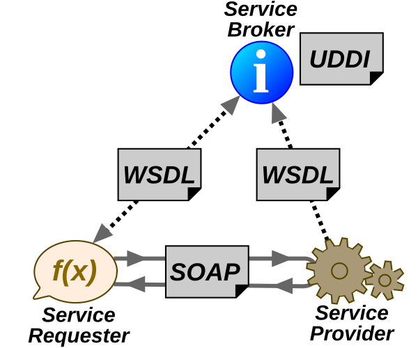

# 2.1. Definición y características ([↑](README.md))

_Contenido creado por Manuel Ignacio López Quintero_

[SOAP](https://en.wikipedia.org/wiki/SOAP) (Simple Object Access Protocol) es un protocolo de comunicación estándar que permite a los diferentes sistemas informáticos interactuar y compartir información a través de la web. Este protocolo se basa en [XML](https://en.wikipedia.org/wiki/XML) para codificar y transportar los mensajes entre los sistemas, y utiliza principalmente [HTTP](https://en.wikipedia.org/wiki/HTTP) como protocolo de transporte, aunque también admite otros protocolos.

## Características de SOAP

SOAP presenta tres **características** principales que lo hacen adecuado para su uso en servicios web:

- **Extensibilidad**: SOAP permite la incorporación de nuevas funcionalidades a través de extensiones, como seguridad y [WS-Addressing](https://en.wikipedia.org/wiki/WS-Addressing), que define un espacio de nombres para identificar servicios web.
- **Neutralidad**: SOAP puede operar sobre cualquier protocolo de transporte, como [HTTP](https://en.wikipedia.org/wiki/HTTP), [SMTP](https://en.wikipedia.org/wiki/Simple_Mail_Transfer_Protocol), [TCP](https://en.wikipedia.org/wiki/Transmission_Control_Protocol) o [UDP](https://en.wikipedia.org/wiki/User_Datagram_Protocol), lo que facilita su adaptación a diferentes contextos y aplicaciones.
- **Independencia**: SOAP permite utilizar cualquier modelo de programación, lo que facilita su implementación en diversos lenguajes y entornos.

## Arquitectura de servicios web

La **arquitectura de servicios web**, según el W3C Working Group Note del 11 de febrero de 2004, describe la interacción entre servicios web.

Fuente: [H. Voormann - Arquitectura de un servicio web](https://en.wikipedia.org/wiki/Web_service#/media/File:Webservices-en.svg)

Según dicha arquitectura, el **proveedor del servicio** (*service provider*) envía un archivo [WSDL](https://en.wikipedia.org/wiki/Web_Services_Description_Language) (Web Services Description Language) al registro [UDDI](https://en.wikipedia.org/wiki/Web_Services_Discovery#Universal_Description_Discovery_and_Integration) (Universal Description, Discovery, and Integration). Cuando un **solicitante de servicio** (*service requester*) necesita una funcionalidad específica, consulta el registro UDDI para encontrar el proveedor del servicio correspondiente.

Una vez que ha encontrado el proveedor adecuado, el solicitante de servicio se comunica con el proveedor de servicio utilizando el protocolo SOAP. Luego, el proveedor del servicio verifica la solicitud y, si es válida, envía datos estructurados en un archivo XML, también utilizando SOAP. El archivo XML contiene la información requerida y puede incluir datos de respuesta o posibles errores que puedan ocurrir durante el proceso.

## Ventajas de SOAP

Entre las **ventajas** que ofrece SOAP se encuentran las siguientes:

- **Estándar y amplia adopción**: SOAP se basa en estándares ampliamente aceptados y ha sido implementado durante muchos años en la industria.
- **Integración con** [cortafuegos](https://en.wikipedia.org/wiki/Firewall_(computing)) **y** [proxies](https://en.wikipedia.org/wiki/Proxy_server) **existentes**: SOAP se integra fácilmente con infraestructuras de comunicación existentes, evitando la necesidad de modificarlas.
- **Aprovecha las facilidades de XML**: SOAP utiliza XML, lo que permite su fácil internacionalización y extensibilidad mediante Namespaces.

## Desventajas de SOAP

Sin embargo, SOAP también tiene **desventajas** como se indican a continuación:

- **Rendimiento afectado por la serialización XML**: la serialización XML en SOAP puede afectar el rendimiento debido a la verbosidad del protocolo.
- **Limitaciones en la flexibilidad de los roles**: en SOAP, los roles de las partes involucradas en la comunicación están fijos, lo que puede limitar la flexibilidad en ciertos escenarios.
- **Limitaciones en comparación con REST**: la popularidad de REST ha disminuido la adopción de SOAP debido a que SOAP no puede aprovechar las características específicas del protocolo HTTP, como la interfaz uniforme de REST. Además, SOAP puede requerir la reimplementación de funciones proporcionadas por protocolos complementarios.

_Contenido creado por Manuel Ignacio López Quintero_
