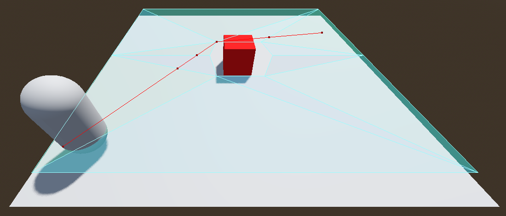

# Tutorial de Navegación 3D en Godot

En este tutorial aprenderás a configurar un sistema básico de navegación 3D utilizando `NavigationRegion3D` y `NavigationAgent3D`. Aprenderás a crear mallas de navegación y mover personajes de forma inteligente en entornos tridimensionales.

La navegación en 3D permite a los personajes moverse evitando obstáculos en entornos complejos. Godot ofrece un sistema robusto con:
- `NavigationRegion3D`: Define áreas navegables
- `NavigationMesh`: Genera superficies transitables
- `NavigationAgent3D`: Calcula rutas y controla el movimiento

## Paso 1: Configura la escena principal

1. Abre Godot y crea un nuevo proyecto. Asegúrate de configurar el _Renderer_ como `Forward+` en la configuración del proyecto.
2. Crea un nodo _Node3D_ seleccionando _3D Scene_ como nodo raíz de la escena principal.
3. Renombra el nodo raíz como _MainScene_ y guarda la escena seleccionando _Scene → Save Scene_. Nómbrala como `main_scene.tscn`.
4. En _Project → Project Settings → General → Display → Window_ establece _Viewport Width_ en `1280` y _Viewport Height_ en `720`.
5. Recuerda los [controles de navegación del _viewport_][T01] para orbitar y desplazarte por la escena 3D.
6. Añade a la escena 3D un [sol][T02] (_Add Sun to Scene_) y luego un [entorno][T03] (_Add Environment to Scene_).
7. Agrega un nodo _Camera3D_ como hijo de _MainScene_ para poder visualizar la escena.
8. Haz clic en _Play Scene_ para verificar que la cámara muestra un horizonte donde el cielo azul claro se separa del suelo marrón.

[T01]: https://github.com/milq/milq.github.io/blob/master/cursos/godot/tutorials/3d_viewport_navigation_controls.md
[T02]: https://raw.githubusercontent.com/milq/milq.github.io/refs/heads/master/cursos/godot/images/add_sun_to_scene.png
[T03]: https://raw.githubusercontent.com/milq/milq.github.io/refs/heads/master/cursos/godot/images/add_environment_to_scene.png

## Paso 2: Configura la malla de navegación

1. Añade un nodo `NavigationRegion3D` como nodo hijo de _MainScene_.
2. Selecciona tu nodo `NavigationRegion3D`
3. En el Inspector, crea un nuevo `NavigationMesh` para este nodo:

4. Añade un nodo `MeshInstance3D` como hijo del nodo `NavigationRegion3D`.
5. Selecciona el nodo `MeshInstance3D` y, en el Inspector, crea un nuevo `PlaneMesh` en el campo _Mesh_ como tipo de malla.
6. Selecciona dicha malla de tipo `PlaneMesh` y establece un tamaño de 10 m en el eje `x` y 10 m en el eje `y`.
7. Selecciona el nodo `NavigationRegion3D` y pulsa en el botón `Bake Navmesh` que está en la barra superior:

8. Ahora verás una malla de navegación semitransparente que flota a cierta distancia por encima del `PlaneMesh`:

9. Por último, selecciona el nodo `Camera3D` y muévelo y gíralo para que se vea el plano con cierta distancia.
10. Haz clic en _Play Scene_ para verificar que la cámara muestra dicho plano con cierta distancia.

## Paso 3: Crear y configurar el personaje

1. Añade un nodo `CharacterBody3D` como nodo hijo de _MainScene_.
2. Luego, añade a `CharacterBody3D` los siguientes nodos como hijos:
    - Un nodo `MeshInstance3D` con una nueva malla de cápsula (`CapsuleMesh`)
    - Un nodo `CollisionShape3D` con una forma (_shape_) de cápsula (`CapsuleShape3D`) que se ajuste a la malla creada anteriormente.
3. Selecciona el nodo `CharacterBody3D` y muévelo verticalmente en el eje `y` para que se sitúe encima del plano.
4. A continuación, agrega un nodo `NavigationAgent3D` como hijo de `CharacterBody3D`.
5. Selecciona el nodo `NavigationAgent3D` y, en el Inspector, ajusta el valor de `Path Height Offset` en `Pathfinding` a `-0.51` m.
6. Por último, adjunta este [_script_](https://github.com/milq/milq.github.io/blob/master/cursos/godot/scripts/player_mouse_agent.gd) al nodo `CharacterBody3D`.

## Paso 4: Ejecución del proyecto

1. En la barra de menú, dirígete a la sección `Debug` y activa la opción `Visible Navigation`. Esto hará que puedas ver las mallas de navegación durante la ejecución del juego. A continuación, selecciona el nodo `NavigationAgent3D` en el árbol de nodos. En el Inspector, dentro del apartado `NavigationAgent3D`, busca la sección `Debug` y activa la depuración cambiando el valor de `Enabled` a `On`. Esto te permitirá visualizar la ruta que sigue el agente en el editor mientras se mueve a través de la malla de navegación.
2. Ejecuta el proyecto, haz clic en una posición del plano y verifica cómo el `CharacterBody3D` se desplaza hacia el punto seleccionado.

## Paso 5: Añadir obstáculos y recalcular la malla de navegación

1. **Añade un nodo para el obstáculo**  
   - Selecciona el nodo `NavigationRegion3D`.  
   - Haz clic en _Add Child Node_ y crea un nuevo `MeshInstance3D`.  
   - Renombra este nuevo nodo como, por ejemplo, `Obstacle`.  

2. **Configura la malla y el material**  
   - Selecciona el nodo `Obstacle` recién creado.  
   - En el _Inspector_, asigna al campo _Mesh_ una `BoxMesh`.  
   - Ajusta el tamaño (parámetros de `BoxMesh`) según lo necesites (por ejemplo, un cubo de 1×1×1).
   - Para darle un color rojo, en la sección _Surface Material Override_ de `MeshInstance3D` del _Inspector_, crea un nuevo material estándar (`New StandardMaterial3D`).  
   - Dentro del material, ajusta el valor del `Albedo` a un tono de rojo.

3. **Ubica el obstáculo en la escena**  
   - Mueve (y si es necesario, rota o escala) el nodo `Obstacle` para que se encuentre sobre el plano (`PlaneMesh`).  
   - Asegúrate de que se superpone con la malla de navegación y no quede flotando en el aire ni por debajo del plano (`PlaneMesh`).

4. **Vuelve a hornear (_bake_) la malla de navegación**  
   - Selecciona el nodo `NavigationRegion3D`.  
   - En la barra superior del editor, haz clic en el botón `Bake Navmesh`.  
   - Si todo está configurado correctamente, verás que la malla de navegación ahora excluye la zona donde se encuentra el cubo rojo.  

5. **Prueba la navegación con el obstáculo**  
   - Ejecuta la escena y haz clic en distintas posiciones alrededor del cubo.  
   - Observa cómo el `CharacterBody3D` recalcula su ruta y esquiva el cubo rojo al desplazarse hacia el punto objetivo.  

6. **Agrega más obstáculos (opcional)**  
   - Repite los pasos anteriores para colocar varios cubos rojos en diferentes posiciones.  
   - Cada vez que añadas o borres un obstáculo, recuerda pulsar de nuevo en `Bake Navmesh` para que la navegación se actualice y el personaje evite dichos objetos.

## Paso 6: Evitar que el personaje atraviese parcialmente el obstáculo (opcional)

Aunque el cálculo de la malla de navegación haga que el agente esquive el obstáculo, puede ocurrir que el `CharacterBody3D` se superponga parcialmente con la malla del cubo (sobre todo en esquinas o bordes). Para evitar que el personaje atraviese el cubo, existen varias opciones. Aquí se muestran dos de ellas:

1. **Usar un `StaticBody3D` con colisión**  
   - Selecciona el nodo `Obstacle`.
   - Añade un nodo hijo de tipo `StaticBody3D`. Renómbralo, por ejemplo, como `ObstacleBody`.
   - Dentro de `ObstacleBody`, añade un nodo `CollisionShape3D`.
   - Asigna una forma de colisión (`BoxShape3D`) y ajusta sus dimensiones para que coincidan con el cubo (`BoxMesh`) del nodo `Obstacle`.
   - De esta manera, tu `CharacterBody3D` detectará el `StaticBody3D` y no podrá atravesarlo.

2. **Ajustar el radio del agente en la malla de navegación**  
   - Selecciona el nodo `NavigationRegion3D`.
   - En el Inspector, dentro de los parámetros de la `NavigationMesh`, hay propiedades que controlan el radio del agente.  
   - Si aumentas este radio (y luego vuelves a pulsar `Bake Navmesh`), la zona de navegación generada alrededor del obstáculo será mayor y, por ende, el agente no se acercará tanto al cubo.  
   - Esta opción es útil para simplificar la geometría de colisión si no deseas añadir cuerpos rígidos o estáticos en la escena.

Después de aplicar cualquiera de estas dos soluciones (o ambas), vuelve a ejecutar la escena y haz clic alrededor del obstáculo para comprobar que ahora el `CharacterBody3D` no se superpone con el cubo rojo. Si optas por la primera alternativa (con `StaticBody3D`), verás cómo el personaje colisiona físicamente; en cambio, si optas por el ajuste del radio en la malla de navegación, el personaje simplemente evitará la zona inmediata al cubo con mayor margen.
