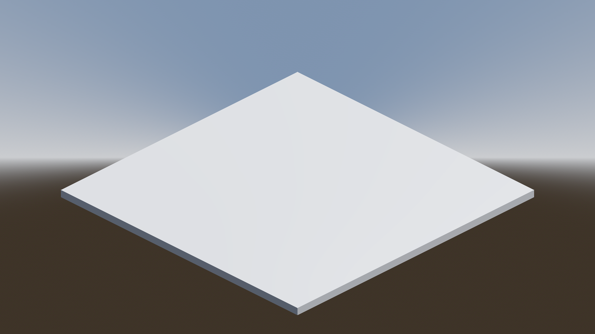

# Tutorial de Navegación 3D en Godot con proyección ortogonal

En este tutorial aprenderás a configurar un sistema básico de navegación 3D utilizando `NavigationRegion3D` y `NavigationAgent3D`. Aprenderás a crear mallas de navegación y mover personajes de forma inteligente en entornos tridimensionales.

La navegación en 3D permite a los personajes moverse evitando obstáculos en entornos complejos. Godot ofrece un sistema robusto con:
- `NavigationRegion3D`: Define áreas navegables
- `NavigationMesh`: Genera superficies transitables
- `NavigationAgent3D`: Calcula rutas y controla el movimiento

## Paso 1: Configura la escena principal

1. Abre Godot y crea un nuevo proyecto. Asegúrate de configurar el _Renderer_ como `Forward+` en la configuración del proyecto.
2. Crea un nodo _Node3D_ seleccionando _3D Scene_ como nodo raíz de la escena principal.
3. Renombra el nodo raíz como _MainScene_ y guarda la escena seleccionando _Scene → Save Scene_. Nómbrala como `main_scene.tscn`.
4. En _Project → Project Settings → General → Display → Window_ establece _Viewport Width_ en `1280` y _Viewport Height_ en `720`.
5. Recuerda los [controles de navegación del _viewport_][T01] para orbitar y desplazarte por la escena 3D.
6. Agrega un nodo _Camera3D_ como hijo de _MainScene_ para poder visualizar la escena.
7. Añade a la escena 3D un [sol][T02] (_Add Sun to Scene_) y luego un [entorno][T03] (_Add Environment to Scene_).
8. Haz clic en _Play Scene_ para verificar que la cámara muestra un horizonte donde el cielo azul claro se separa del suelo marrón.

[T01]: https://github.com/milq/milq.github.io/blob/master/cursos/godot/tutorials/3d_viewport_navigation_controls.md
[T02]: https://raw.githubusercontent.com/milq/milq.github.io/refs/heads/master/cursos/godot/images/add_sun_to_scene.png
[T03]: https://raw.githubusercontent.com/milq/milq.github.io/refs/heads/master/cursos/godot/images/add_environment_to_scene.png

## Paso 2: Configura la malla de navegación

1. Añade un nodo `NavigationRegion3D` como nodo hijo de _MainScene_.
2. Selecciona tu nodo `NavigationRegion3D`
3. En el Inspector, crea un nuevo `NavigationMesh` para este nodo:

4. Añade un nodo `MeshInstance3D` como hijo del nodo `NavigationRegion3D`.
5. Selecciona el nodo `MeshInstance3D` y, en el Inspector, crea un nuevo `BoxMesh` en el campo _Mesh_ como tipo de malla.
6. Selecciona dicha malla de tipo `PlaneMesh` y establece un tamaño de 20 m en el eje `x`, 0.5 m en el eje `y` y 20 m en el eje `z`.
7. Selecciona el nodo `NavigationRegion3D` y pulsa en el botón `Bake Navmesh` que está en la barra superior:

8. Ahora verás una malla de navegación semitransparente que flota a cierta distancia por encima del `PlaneMesh`:

## Paso 3: Configura la cámara 3D para proyección ortogonal y posiciónala

1. Selecciona el nodo `Camera3D` en el _Scene Tree_.
2. En el Inspector, cambia la propiedad `Projection` de `Perspective` a `Orthogonal`.  
3. Ajusta el valor de `Size` a `20` para definir el área que capturará la cámara y abarcar todo el plano.
4. Luego, abajo, en la sección `Transform` de `Node3D`, posiciona la cámara en `x = 10`, `y = 10` y `z = 10`.
5. A continuación, justo debajo, rota la cámara `x = -30°`, `y = 45°` y `z = 0°`.
6. Ejecuta el proyecto y comprueba que la cámara muestra el plano con una proyección ortogonal o en perspectiva isómetrica:

