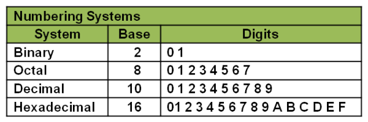
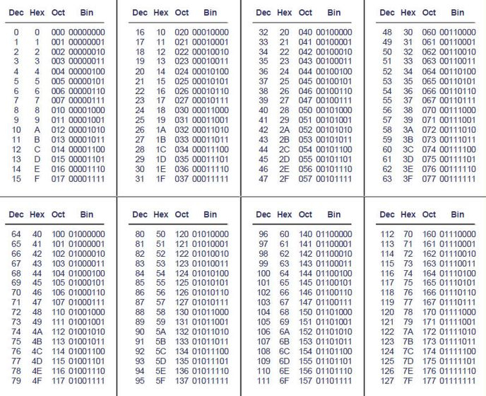
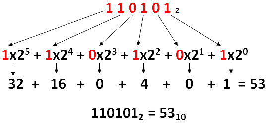
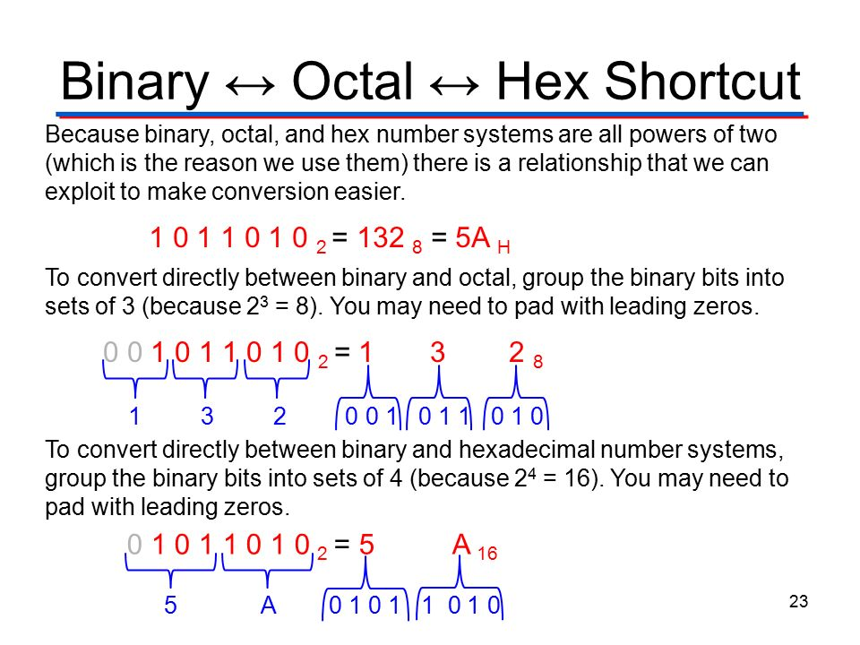

# NUMBERING SYSTEMS

## Decimal to binary

## Binary to decimal

## Conversion between binary, octal, and hexadecimal numbers

## Exercises

1. Convert C5C1 from base 16 to base 2.
2. Convert 238 from base 10 to base 2.
3. Convert 1010 0010 1011 1001 from binary to hexadecimal.
4. Convert 0 from base 8 to binary.
5. Convert 0111 0110 1011 1011 from binary to base 16.
6. Convert 0100 0100 1000 0011 from binary to base 16.
7. Convert 0001 1101 1101 1111 from base 2 to hexadecimal.
8. Convert 53 from base 8 to base 2.
9. Convert 1101 1111 from base 2 to decimal.
10. Convert 0100 0110 1101 0111 from binary to base 16.
11. Convert 101 100 001 from binary to base 8.
12. Convert 0110 0100 1000 1101 from binary to base 16.
13. Convert 44 from base 8 to binary.
14. Convert 9ABF from base 16 to base 2.
15. Convert 1100 1111 from base 2 to base 10.
16. Convert 10B2 from base 16 to binary.
17. Convert A1ED from base 16 to binary.
18. Convert 1010 0001 1111 1100 from base 2 to base 16.
19. Convert 77 from base 8 to binary.
20. Convert 1000 1111 from binary to decimal.
21. Convert 0011 1101 from base 2 to base 10.
22. Convert 57 from base 8 to binary.
23. Convert 0100 0100 1011 0100 from binary to hexadecimal.
24. Convert 0110 0110 from binary to base 10.
25. Convert 31 from octal to binary.
26. Convert 1110 1101 from base 2 to base 10.
27. Convert ec2c from base 16 to base 2.
28. Convert 208 from base 10 to binary.
29. Convert 1 from base 10 to binary.
30. Convert 101 from base 2 to base 8.

## Solution to exercises

1\. 1100 0101 1100 0001. 
2\. 1110 1110. 
3\. A2B9. 
4\. 0. 
5\. 76BB. 
6\. 4483. 
7\. 1DDF. 
8\. 101 011. 
9\. 223. 
10\. 46D7. 
11\. 541. 
12\. 648D. 
13\. 100 100. 
14\. 1001 1010 1011 1111. 
15\. 207. 
16\. 0001 0000 1011 0010. 
17\. 1010 0001 1110 1101. 
18\. A1FC. 
19\. 111 111. 
20\. 143. 
21\. 61. 
22\. 101 111. 
23\. 44B4. 
24\. 102. 
25\. 011 001. 
26\. 237. 
27\. 1110 1100 0010 1100. 
28\. 1101 0000. 
29\. 0001. 
30\. 5. 
